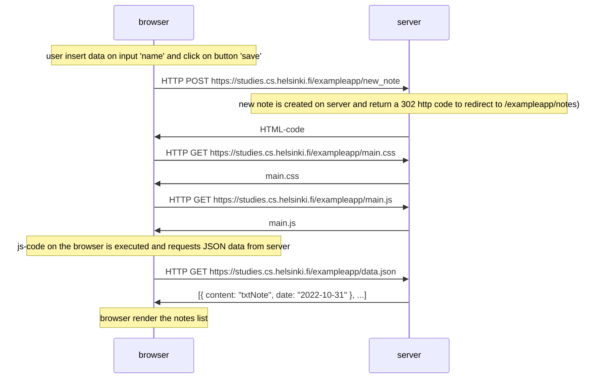

```mermaid
sequenceDiagram
    participant browser
    Note over browser: user insert data on input 'name' and click on button 'save'
    participant server
    browser->>server: HTTP POST https://studies.cs.helsinki.fi/exampleapp/new_note
    Note over server: new note is created on server and return a 302 http code to redirect to /exampleapp/notes)
    server->>browser: HTML-code
    browser->>server: HTTP GET https://studies.cs.helsinki.fi/exampleapp/main.css
    server->>browser: main.css
    browser->>server: HTTP GET https://studies.cs.helsinki.fi/exampleapp/main.js
    server->>browser: main.js
    Note over browser: js-code on the browser is executed and requests JSON data from server 
    browser->>server: HTTP GET https://studies.cs.helsinki.fi/exampleapp/data.json
    server->>browser: [{ content: "txtNote", date: "2022-10-31" }, ...]
    Note over browser: browser render the notes list
```
