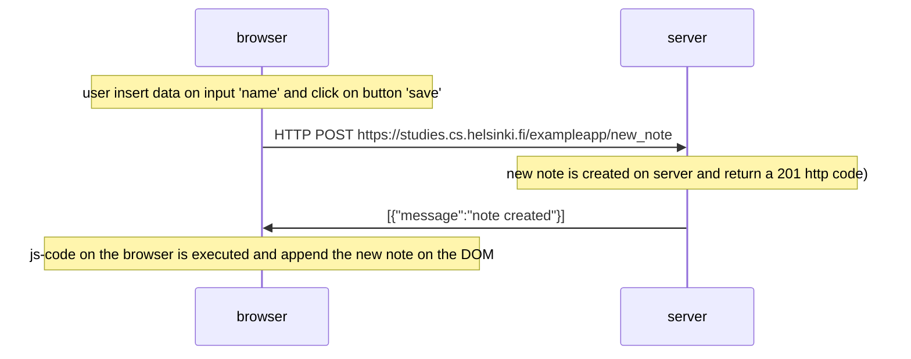

```mermaid
sequenceDiagram
    participant browser
    Note over browser: user insert data on input 'name' and click on button 'save'
    participant server
    browser->>server: HTTP POST https://studies.cs.helsinki.fi/exampleapp/new_note
    Note over server: new note is created on server and return a 201 http code)
    server->>browser: [{"message":"note created"}]
    Note over browser: js-code on the browser is executed and append the new note on the DOM
```
