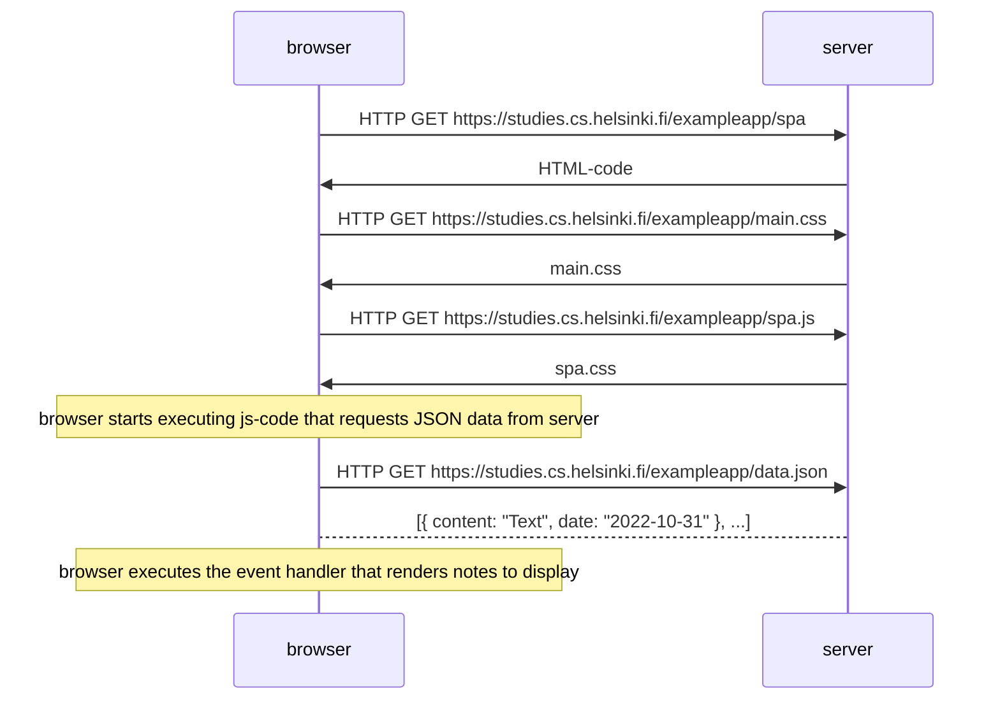

```mermaid
sequenceDiagram
    participant browser
    participant server
    browser->>server: HTTP GET https://studies.cs.helsinki.fi/exampleapp/spa
    server->>browser: HTML-code
    browser->>server: HTTP GET https://studies.cs.helsinki.fi/exampleapp/main.css
    server->>browser: main.css
    browser->>server: HTTP GET https://studies.cs.helsinki.fi/exampleapp/spa.js
    server->>browser: spa.css
    Note over browser: browser starts executing js-code that requests JSON data from server
    browser->>server: HTTP GET https://studies.cs.helsinki.fi/exampleapp/data.json
    server-->browser: [{ content: "Text", date: "2022-10-31" }, ...]
    Note over browser: browser executes the event handler that renders notes to display
```
